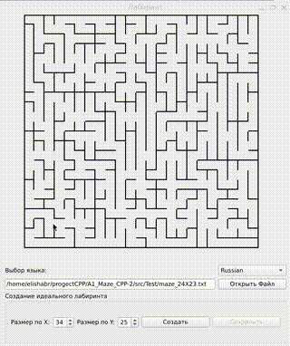

## Проект A1_MAZE_CPP - School 21
#### Назначение программы:

Программа предназначена для генерации лабиринта методом Эйлера, а также для построения лабиринта по данным из файла. После генерации или загрузки лабиринта, программа позволяет найти кратчайший путь между двумя произвольными точками в лабиринте.

- *Интерфейс моей программы*

- *Web-Интерфейс моей программы*

#### Основные функции:
- Генерация лабиринта методом Эйлера:  

- Загрузка лабиринта из файла:  

- Поиск пути в лабиринте:  

#### Дополнительные возможности:
- Сохранение лабиринта в файл: 
- Смена языка интерфейса 
- Web версия для мультиплатформенности
#### Использованные технологии при написании программы: 
    Qt Widgets, CMake, WebAssembly, C++17

/ *при запуске web версии убедитесь, что у вас есть python 3 http.server иначе не заработает*